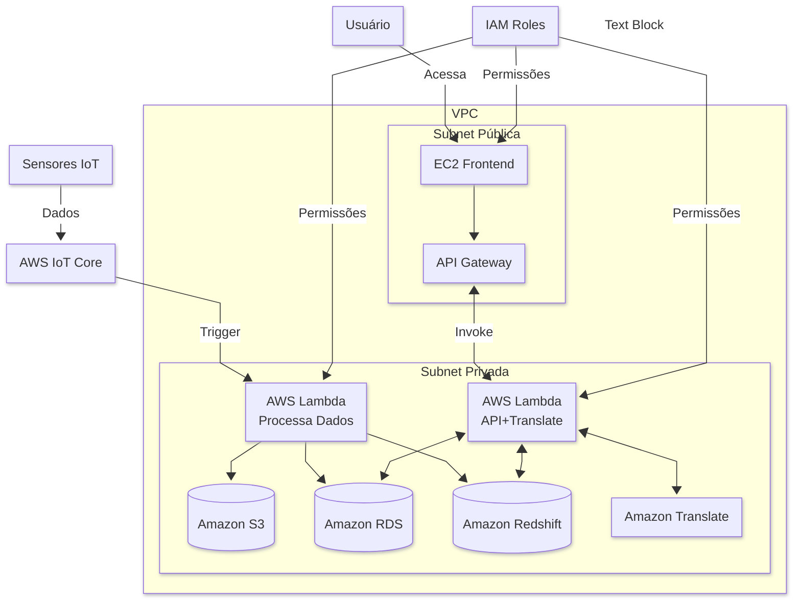

# Projeto_Cloud
Repositório com o projeto de cloud com 10 serviços

## Solução: Sistema de Monitoramento IoT com Tradução Automática
### Passo 1: Coleta de Dados (AWS IoT Core)
* Dispositivos IoT (sensores) enviam dados (ex: temperatura, umidade) via protocolo MQTT/HTTP para o AWS IoT Core.

* O IoT Core valida e autentica os dispositivos usando certificados X.509 (gerenciados pelo IAM).

### Passo 2: Processamento Inicial (Lambda + VPC)
* O IoT Core dispara uma função Lambda (LAMBDA_PROCESS) configurada dentro de uma subnet privada da VPC.
* Essa Lambda:

  * Valida os dados recebidos
    
  * Converte para formato JSON/Parquet
    
  * Salva em 3 lugares:
    
  * Amazon S3: Armazenamento bruto (data lake)
    
  * Amazon RDS (PostgreSQL): Para consultas rápidas (ex: último valor do sensor)
    
  * Amazon Redshift: Para análises históricas (ex: médias mensais)

### Passo 3: API Gateway + Tradução (Lambda + Translate)
* Um frontend hospedado em EC2 (subnet pública) faz chamadas para o API Gateway.

* O API Gateway possui dois endpoints:

  * `/realtime`: Invoca uma segunda Lambda (LAMBDA_API) que consulta o RDS.

  * `/analytics`: Invoca a mesma Lambda para consultar o Redshift.

* Antes de retornar os dados, a LAMBDA_API:

  * Chama o Amazon Translate para converter textos de inglês para português (ex: descrições de alertas).

  * Aplica filtros/agregações conforme necessário.

### Passo 4: Visualização (EC2 Frontend)
* A instância EC2 (subnet pública) executa um frontend simples (ex: React ou Flask).

* Consome os endpoints do API Gateway e exibe:

  * Dados em tempo real (via RDS)

  * Gráficos analíticos (via Redshift)

  * Conteúdo já traduzido (via Translate)

### Infraestrutura de Suporte
* VPC:

  * Subnet pública: EC2 e NAT Gateway (para acesso à internet).

  * Subnet privada: Lambdas, RDS, Redshift.

  * Security Groups: Restringem tráfego entre camadas.

* IAM:

  * Políticas granulares para cada serviço:

  * Lambda pode escrever no S3/RDS/Redshift.

  * EC2 pode invocar apenas o API Gateway.

  * Lambda de API tem permissão para o Translate.

### Armazenamento Adicional:

* Amazon EFS: Pode ser montado no EC2 para armazenar assets do frontend (ex: imagens, templates).

## Diagrama

