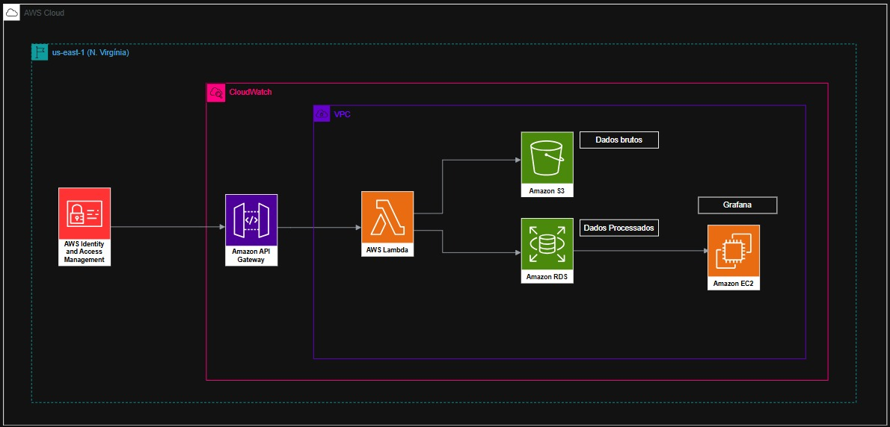

# ☁️ Projeto AWS – Coleta, Processamento e Visualização de Dados Ambientais

## 🎯 Objetivo

Criar uma arquitetura robusta, escalável e integrada, focada em:
- Receber dados externos via API,
- Armazenar dados brutos no S3,
- Processar e armazenar no RDS,
- Visualizar os dados no Grafana via EC2,
- Monitorar com CloudWatch,
- Proteger com IAM e VPC.


## 🗺️ Arquitetura da Solução




## 🔧 Serviços Utilizados

### 1. **Amazon API Gateway**
- Recebe dados via HTTP.
- Interface pública e segura para ingestão de dados.

### 2. **AWS Lambda**
- Função serverless que processa os dados e envia para S3 e RDS.
- Escalável e sem servidor.

### 3. **Amazon S3**
- Armazena os dados brutos recebidos da API.
- Backup e histórico de tudo que entra no sistema.

### 4. **Amazon RDS**
- Banco de dados relacional (MySQL/PostgreSQL).
- Armazena os dados tratados para consulta e visualização.

### 5. **Amazon EC2**
- Instância com **Grafana** instalado.
- Realiza a visualização dos dados do RDS em dashboards.

### 6. **Amazon CloudWatch**
- Coleta logs da Lambda e métricas do EC2.
- Permite criar alertas e acompanhar desempenho.

### 7. **AWS IAM**
- Garante que cada serviço só acesse o que precisa.

### 8. **VPC**
- Isola os recursos críticos (RDS, EC2).
- Aumenta a segurança e performance da comunicação entre serviços.


## 📊 Exemplo de Payload Enviado para API

```json
{
  "timestamp": "2025-06-06T15:35:27",
  "temperatura": 30.6,
  "umidade": 20
}
```