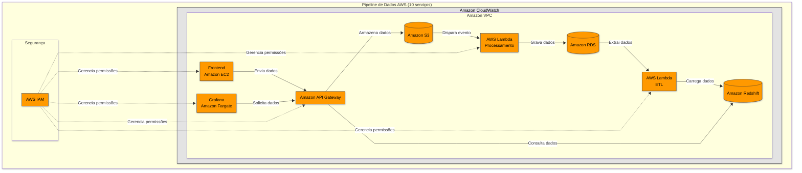

# Pipeline de Dados na AWS com Observabilidade

## Visão Geral da Arquitetura

Solução completa utilizando 10 serviços AWS para coleta, processamento, armazenamento e visualização de dados com segurança e monitoramento integrados.

## Componentes da Arquitetura

### 1. Camada de Coleta
- **Amazon EC2** (Frontend)
  - Instância responsável pela interface de coleta de dados
  - Configurada com IAM Role para acesso seguro a outros serviços

- **Amazon API Gateway**
  - Recebe requisições do frontend
  - Valida e transforma os dados antes do armazenamento
  - Configuração de throttling e cache

### 2. Camada de Armazenamento
- **Amazon S3** (Dados brutos)
  - Bucket com versionamento ativado
  - Política de lifecycle para transição entre classes de armazenamento
  - Event Notification para disparar processamento

### 3. Camada de Processamento
- **AWS Lambda** (Processamento)
  - Função Python/Node.js para transformação dos dados
  - Timeout e memory adequados ao volume
  - Conecta ao RDS via VPC

- **AWS Lambda** (ETL)
  - Função dedicada para extração de dados analíticos
  - Schedule via EventBridge para execução periódica

### 4. Bancos de Dados
- **Amazon RDS** (PostgreSQL/MySQL)
  - Instância dentro de VPC
  - Multi-AZ para alta disponibilidade
  - Backups automáticos habilitados

- **Amazon Redshift**
  - Cluster dedicado para análise
  - Modelo dimensional implementado
  - Redshift Spectrum para consulta direta no S3

### 5. Visualização
- **Amazon Fargate** (Grafana)
  - Container com Grafana em execução
  - Service Discovery para endpoint estável
  - Auto-scaling configurado

### 6. Segurança
- **Amazon VPC**
  - Subnets públicas e privadas
  - NACLs e Security Groups restritivos
  - VPC Endpoints para serviços AWS

- **AWS IAM**
  - Políticas granulares por serviço
  - Roles com princípio de menor privilégio
  - Grupos para administradores e usuários

### 7. Monitoramento
- **Amazon CloudWatch**
  - Dashboards unificados
  - Alarmes para métricas críticas
  - Logs centralizados com retenção configurada

## Fluxo de Dados

1. `EC2 → API Gateway`: Dados coletados via requisições HTTP
2. `API Gateway → S3`: Armazenamento como JSON/Parquet
3. `S3 → Lambda`: Disparo por evento de upload
4. `Lambda → RDS`: Inserção em modelo relacional
5. `RDS → Lambda`: Extração periódica de agregados
6. `Lambda → Redshift`: Carga no data warehouse
7. `Fargate → API Gateway`: Consultas do Grafana
8. `API Gateway → Redshift`: Respostas analíticas

## Diagrama

